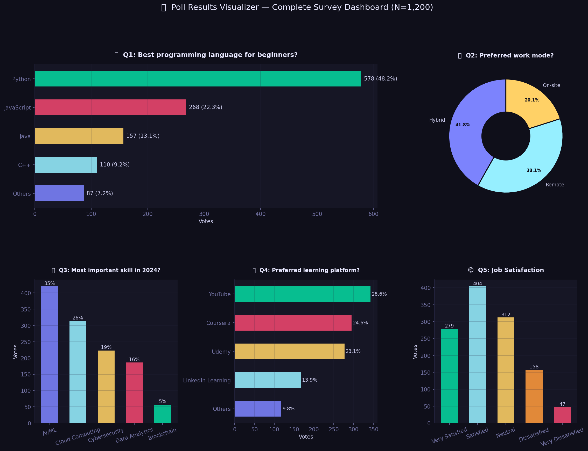
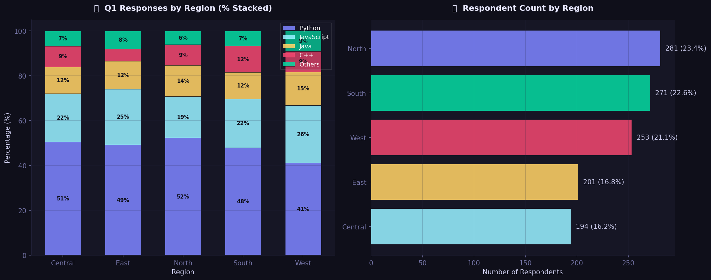
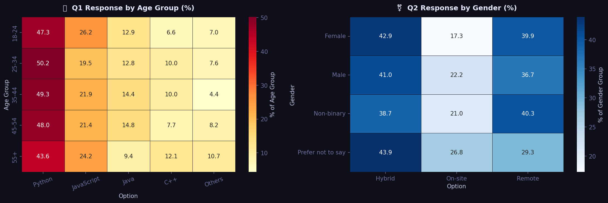
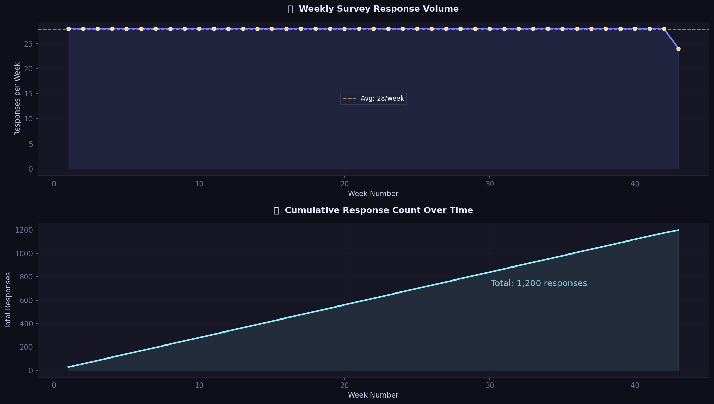
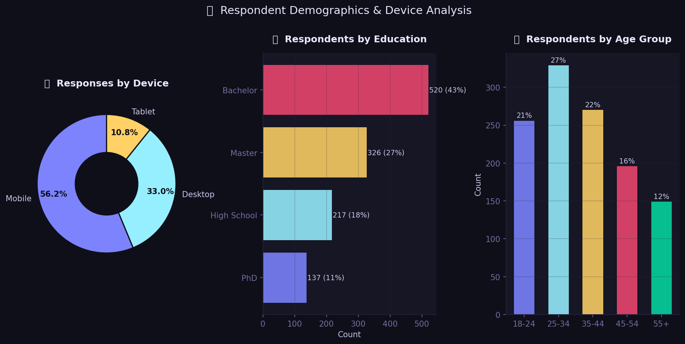

# 📊 Poll Results Visualizer

A survey analytics project that visualizes poll responses from 1,200 participants across 5 questions covering tech preferences, work styles, and job satisfaction. Includes regional breakdowns, demographic heatmaps, and auto-generated insights.

---

## 📊 Project Overview

| Item | Details |
|---|---|
| Dataset | Synthetic — 1,200 respondents, 5 questions, 5 regions |
| Age Groups | 18-24, 25-34, 35-44, 45-54, 55+ |
| Survey Period | January – October 2024 |
| Libraries | pandas, numpy, matplotlib, seaborn |

---

## 🔍 What This Project Does

- Simulates realistic survey data with regional and demographic variation
- Visualizes all 5 poll questions with different chart types
- Breaks down responses by region, age group, and gender
- Tracks weekly response volume and cumulative engagement
- Auto-generates key findings per question

---

## 🏆 Poll Results Summary

| Question | Winner | % |
|---|---|---|
| Best language for beginners | Python | 48.2% |
| Preferred work mode | Hybrid | 41.8% |
| Most important skill 2024 | AI/ML | 35.0% |
| Best learning platform | YouTube | 28.6% |
| Job satisfaction | Satisfied | 33.7% |

---

## 📈 Output Charts

### Full Poll Dashboard (All 5 Questions)


### Regional Analysis


### Demographic Heatmaps


### Response Trend Over Time


### Respondent Demographics


---

## 🛠️ Tech Stack

- Python 3.x
- Pandas, NumPy
- Matplotlib, Seaborn

---

## ▶️ How to Run

```bash
pip install pandas numpy matplotlib seaborn
```

Open `Poll_Results_Visualizer.ipynb` in Jupyter Notebook and run all cells.

---

## 📁 Project Files

| File | Description |
|---|---|
| `Poll_Results_Visualizer.ipynb` | Main notebook |
| `poll_data.csv` | 1,200-respondent survey dataset |
| `chart1_poll_dashboard.png` | All 5 questions dashboard |
| `chart2_regional_analysis.png` | Regional stacked breakdown |
| `chart3_demographic_heatmap.png` | Age + gender heatmaps |
| `chart4_response_trend.png` | Weekly response trend |
| `chart5_demographics.png` | Respondent profile |
